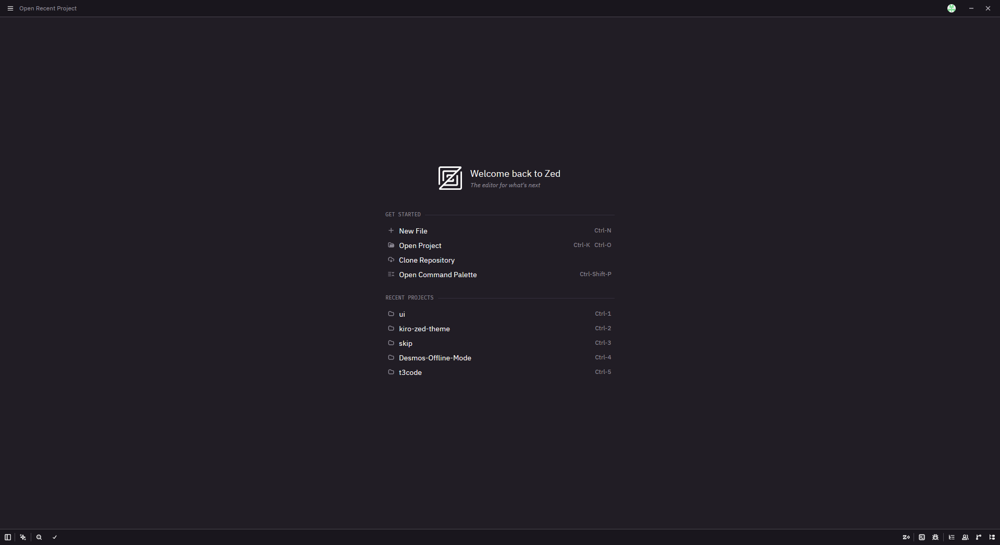
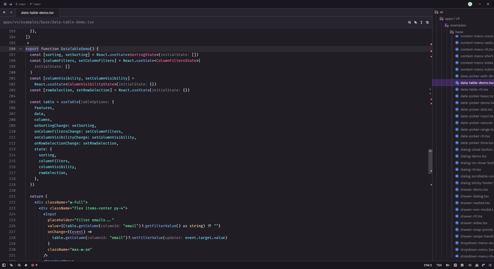

# Kiro Default Themes for Zed

Faithful ports of Kiro's built-in dark and light color themes for
[Zed](https://zed.dev/). They bring Kiro's understated palette and comfortable
contrast to Zed while preserving the character of the original themes.

## Screenshots

### Welcome screen

### Editor

## Included themes

- Kiro Dark
- Kiro Light

The port covers Zed's interface, editor, syntax highlighting, diagnostics, Git
states and diffs, collaboration cursors, and terminal ANSI colors.

Both themes are intended to feel complete throughout the editor, whether you
are writing code, reviewing a diff, working in the terminal, or navigating
Zed's panels and menus.

## Install for development

1. Clone this repository.
2. In Zed, open the Extensions page.
3. Select **Install Dev Extension** and choose this repository's root folder.
4. Open the theme selector and choose **Kiro Dark** or **Kiro Light**.

## Source

The palettes are based on Kiro's built-in `Kiro Dark` and `Kiro Light` theme
definitions from its `theme-defaults` application extension. VS Code TextMate
scopes were mapped to Zed's Tree-sitter syntax captures, and VS Code workbench
colors were mapped to their closest Zed theme equivalents.

This is an independent community port and is not affiliated with or endorsed by
Kiro or Amazon Web Services.

## License

[MIT](LICENSE)
